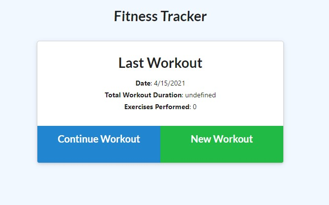

#  HW 17 - NoSQL Exercise Tracker 

## Description

This web application allows users to enter and track various types of exercise information and then view their total time/weights logged and keep track of their exercises over time. Mongodb is utilized to store workout information for the user and mongoAtlas is used to host this information in the cloud.

## Installation

* Navigate to https://github.com/mpkahn/exercise_tracker and clone repository to local machine.

* To run locally: 
* Install npm (`npm i`). 
* Install any other necessary modules
* Create mongodb database locally using Robo-3T named "workoutdb"
* Seed databause using `npm run seed`
* Once NPM is installed, run "npm start" to launch application and go to localhost/3001 in browser

## Usage 

* App hosted at https://pure-depths-98965.herokuapp.com/

* On site, view curren workouts logged main page (if any)

* Click New Workout
* Enter in resistence or cardio workout information

* Click "add exercise" followed by "complete" when done adding information
* View updated workout info on main page
* Click Dashboard to view graphs of workout information

## Credits

* node.js and its documentation https://nodejs.org/api/fs.html 
* Express
* Mongoose
* Mongodb
* Mongo Atlas
* Heroku

## License

MIT License

Copyright (c) [2021] [Michael Kahn]

Permission is hereby granted, free of charge, to any person obtaining a copy
of this software and associated documentation files (the "Software"), to deal
in the Software without restriction, including without limitation the rights
to use, copy, modify, merge, publish, distribute, sublicense, and/or sell
copies of the Software, and to permit persons to whom the Software is
furnished to do so, subject to the following conditions:

The above copyright notice and this permission notice shall be included in all
copies or substantial portions of the Software.

THE SOFTWARE IS PROVIDED "AS IS", WITHOUT WARRANTY OF ANY KIND, EXPRESS OR
IMPLIED, INCLUDING BUT NOT LIMITED TO THE WARRANTIES OF MERCHANTABILITY,
FITNESS FOR A PARTICULAR PURPOSE AND NONINFRINGEMENT. IN NO EVENT SHALL THE
AUTHORS OR COPYRIGHT HOLDERS BE LIABLE FOR ANY CLAIM, DAMAGES OR OTHER
LIABILITY, WHETHER IN AN ACTION OF CONTRACT, TORT OR OTHERWISE, ARISING FROM,
OUT OF OR IN CONNECTION WITH THE SOFTWARE OR THE USE OR OTHER DEALINGS IN THE
SOFTWARE.

